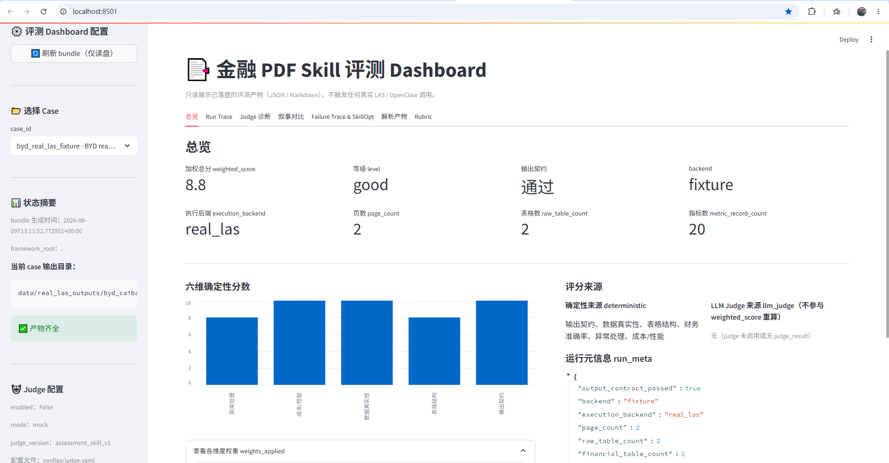
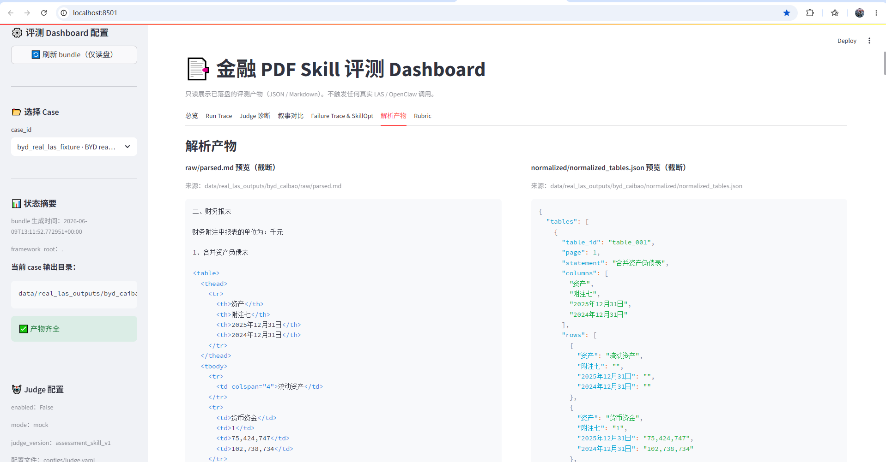
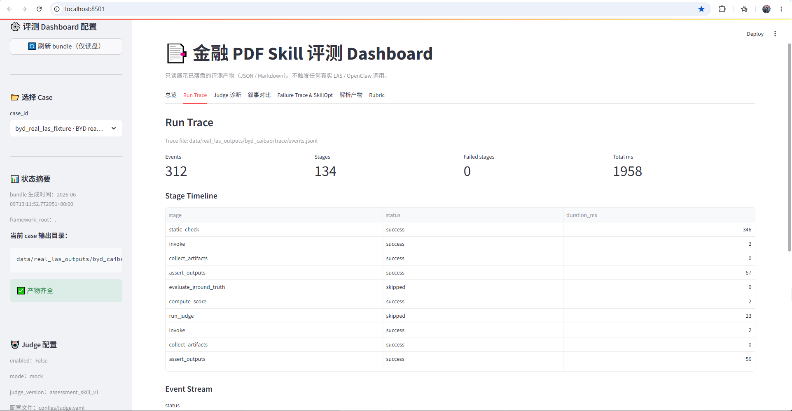
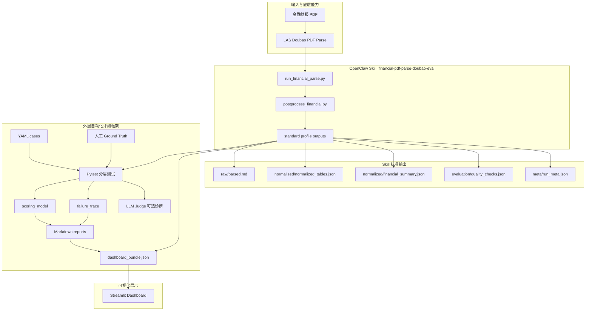

# Financial PDF Parse Skill Evaluation

<p align="center">
  <strong>基于 OpenClaw + LAS Doubao PDF Parse 的金融财报 PDF 解析增强 Skill 与自动化评测框架</strong>
</p>

<p align="center">
  
  
  
  
  
  
  
</p>

<p align="center">
  从 PDF 解析到自动化评测，构建可交付、可验证、可复现的金融财报 Skill。
</p>

<p align="center">
  <a href="financial-pdf-skill-eval-framework/reports/final/final_project_report_skill.md">项目报告</a>
  · <a href="financial-pdf-skill-eval-framework/reports/markdown/evaluation_summary.md">评测摘要</a>
  · <a href="financial-pdf-skill-eval-framework/reports/markdown/score_summary.md">评分汇总</a>
  · <a href="skills/financial-pdf-parse-doubao-eval/SKILL.md">Skill 文档</a>
  · <a href="financial-pdf-skill-eval-framework/README_zh.md">评测框架文档</a>
  · <a href="financial-pdf-skill-eval-framework/README_zh.md#展示-ui-streamlit-dashboard只读">Dashboard 使用说明</a>
</p>


## 目录

- [Financial PDF Parse Skill Evaluation](#financial-pdf-parse-skill-evaluation)
  - [目录](#目录)
  - [项目定位](#项目定位)
  - [最终交付成果](#最终交付成果)
  - [Demo 展示](#demo-展示)
    - [1. Dashboard 总览](#1-dashboard-总览)
    - [2. 解析产物预览](#2-解析产物预览)
    - [3. Run Trace](#3-run-trace)
  - [Run Trace 展示了事件数、阶段数、失败阶段数和阶段耗时，适合证明自动化评测流水线有过程记录，而不是只做静态截图。](#run-trace-展示了事件数阶段数失败阶段数和阶段耗时适合证明自动化评测流水线有过程记录而不是只做静态截图)
  - [系统架构](#系统架构)
  - [评测方案](#评测方案)
  - [当前评测结果](#当前评测结果)
  - [快速开始](#快速开始)
    - [路径 A：只读已有成果，不运行代码](#路径-a只读已有成果不运行代码)
    - [路径 B：离线验证，不调用 LAS](#路径-b离线验证不调用-las)
    - [路径 C：真实 LAS 执行](#路径-c真实-las-执行)
  - [Docker 打包运行](#docker-打包运行)
  - [典型案例](#典型案例)
  - [仓库结构](#仓库结构)
  - [关键文档](#关键文档)

## 项目定位

金融财报 PDF 的难点不只是“识别文字”，而是要在复杂版面中稳定恢复表格结构、财务指标、期间列和数值语义。典型挑战包括：

- 跨页表格、无边框表格、多级表头；
- 密集金额、负数、单位、期间列和小数精度；
- 扫描件、页眉页脚、印章水印和阅读顺序干扰；
- 仅靠人工抽检难以证明解析质量；
- 输出没有稳定契约时，无法做自动化回归。

本项目在官方 `byted-las-pdf-parse-doubao` / LAS PDF Parse 能力之上，交付两个相互解耦的部分：

| 部分 | 角色 | 说明 |
|---|---|---|
| `skills/financial-pdf-parse-doubao-eval` | 被测 Skill | 调用 LAS / lasutil，执行金融后处理，产出 standard profile |
| `financial-pdf-skill-eval-framework` | 外层评测框架 | 管理 YAML case、Ground Truth、pytest、评分模型、报告和 Dashboard |

## 最终交付成果

| 交付物 | 说明 | 对应材料 |
|---|---|---|
| 金融财报 PDF 解析 Skill | 独立 Skill 包，版本 `0.3.0`，负责 PDF 解析调用、金融后处理、标准化输出与质量检查 | [Skill 交付文档](skills/financial-pdf-parse-doubao-eval/SKILL.md) |
| standard 输出契约 | 固定 `raw / normalized / evaluation / meta` 输出结构，保证评测框架可稳定消费解析结果 | [输出契约说明](financial-pdf-skill-eval-framework/README_zh.md) |
| 自动化评测框架 | 支持 YAML 用例、fixture/offline 回归、Pytest 分层测试、GT 对比和报告生成 | [评测框架目录](financial-pdf-skill-eval-framework/) |
| 评测结果报告 | 汇总代表性样本的输出契约、结构统计、准确率口径、评分结果与失败案例 | [评测结果摘要](financial-pdf-skill-eval-framework/reports/markdown/evaluation_summary.md) |
| Dashboard 展示页 | 只读展示 Dashboard bundle、run_meta、结构统计、评分来源和解析产物，适合答辩现场演示 | [可视化展示模块](financial-pdf-skill-eval-framework/dashboard/) |
| Docker 打包环境 | 将 Dashboard 与离线评测依赖封装为可复现环境，降低本地部署和演示成本 | [容器化部署配置](financial-pdf-skill-eval-framework/Dockerfile) |

## Demo 展示

### 1. Dashboard 总览



展示当前 case 的加权分、等级、输出契约、执行后端、页数、表格数和指标数。

### 2. 解析产物预览



左侧是 `raw/parsed.md`，右侧是 `normalized/normalized_tables.json`。它说明本项目不是只给一个分数，而是保留了从 LAS 解析结果到标准化结构的可追溯产物。

### 3. Run Trace



Run Trace 展示了事件数、阶段数、失败阶段数和阶段耗时，适合证明自动化评测流水线有过程记录，而不是只做静态截图。
---

## 系统架构



三层边界：

| 层级 | 作用 |
|---|---|
| LAS 底层能力 | 负责 PDF 解析、OCR、版面和基础结构输出 |
| Skill 层 | 负责金融财报后处理、指标抽取、质量检查和标准输出 |
| 评测层 | 负责用例、GT、断言、评分、失败分析、报告和 Dashboard |

---

## 评测方案

本项目采用四层评测体系，避免把“文件齐全”误写成“解析准确”。

| 层级 | 指标 | 判断标准 |
|---|---|---|
| 输出契约层 | 必需文件、JSON 合法性、Markdown 非空、profile | `raw/parsed.md`、`normalized_tables.json`、`financial_summary.json`、`quality_checks.json`、`run_meta.json` 存在且可读 |
| 结构统计层 | raw table、financial table、metric count、page count | 统计结构化产物中的表格数、财务表数、指标条数 |
| GT 准确率层 | `exact_match_accuracy`、`numeric_accuracy` | 仅对人工 Ground Truth 且 source 合法的样本计算；数值匹配采用代码中的容差规则 |
| 质量诊断层 | LLM Judge、Failure Trace、SkillOpt-style patch gate | 作为辅助诊断，不替代人工 GT，也不覆盖 deterministic score |

> [!WARNING]
> `financial_summary.json` 是 Skill 的 actual 输出，不是 Ground Truth。没有人工 GT 的 case 只能做输出契约和结构统计，不能进入准确率分母。

## 当前评测结果

以下数字来自当前已落盘报告和本地验证命令：

| 指标 | 当前结果 | 证据 |
|---|---:|---|
| real-execution samples | 15 | [evaluation_summary.md](financial-pdf-skill-eval-framework/reports/markdown/evaluation_summary.md) |
| accuracy-evaluation samples | 2 | [evaluation_summary.md](financial-pdf-skill-eval-framework/reports/markdown/evaluation_summary.md) |
| output contract 代表性通过样本 | 15 / 15 | [evaluation_summary.md](financial-pdf-skill-eval-framework/reports/markdown/evaluation_summary.md) |
| Dashboard bundle 展示 case | 38 | 本地运行 `python run.py --build-dashboard-bundle` 后启动 Dashboard |
| 离线自动化测试 | 199 passed, 25 deselected | `python -m pytest -q -m offline -p no:cacheprovider` |
| Skill 版本 | 0.3.0 | [\_meta.json](skills/financial-pdf-parse-doubao-eval/_meta.json) |

Ground Truth 准确率只统计人工标准答案样本：

| case_id | 场景 | exact_match_accuracy | numeric_accuracy | 说明 |
|---|---|---:|---:|---|
| `byd_real_las_fixture_gt_test` | 真实财报片段，2 页，20 条指标 | 1.0 | 1.0 | 成功样本，用于证明 standard 输出与人工 GT 对齐 |
| `先锋财报_扫码件-6-9` | 扫描件 / 低质量财报 | 0.0 | 0.0 | 失败样本，用于暴露扫描件和指标恢复问题 |

## 快速开始

### 路径 A：只读已有成果，不运行代码

- [项目报告](financial-pdf-skill-eval-framework/reports/final/final_project_report_skill.md)
- [评测摘要](financial-pdf-skill-eval-framework/reports/markdown/evaluation_summary.md)
- [评分汇总](financial-pdf-skill-eval-framework/reports/markdown/score_summary.md)
- [OpenClaw / LAS 证据](financial-pdf-skill-eval-framework/reports/markdown/openclaw_invocation_log.md)
- Dashboard：先 `python run.py --build-dashboard-bundle`，再 `python run.py --serve-dashboard`（产物不入库，见 `.gitignore`）

### 路径 B：离线验证，不调用 LAS

Windows PowerShell：

```powershell
cd financial-pdf-skill-eval-framework
python -m venv .venv
.\.venv\Scripts\activate
pip install -r requirements.txt
pip install -r requirements-dashboard.txt

# 不调用 LAS，不产生费用
python -m pytest -q -m offline
python run.py --build-dashboard-bundle
python run.py --serve-dashboard
```

浏览器打开：

```text
http://localhost:8501
```

### 路径 C：真实 LAS 执行

真实 LAS 调用需要显式配置环境变量，并可能产生调用成本：

```powershell
$env:LAS_API_KEY="..."
$env:LAS_REGION="cn-beijing"
$env:ALLOW_REAL_LAS="1"

cd financial-pdf-skill-eval-framework
python run.py --pipeline --cases testcases/pdf_cases/byd_real_las_fixture.yaml --backend real_las
```


## Docker 打包运行

本仓库提供一个面向 Dashboard 展示和离线验证的 Dockerfile。默认启动 Streamlit Dashboard，只读取已落盘的 JSON / Markdown 产物，不触发真实 LAS / OpenClaw 调用。

```bash
# 在仓库根目录执行
docker build -t financial-pdf-skill-eval:latest .

# 启动只读 Dashboard
docker run --rm -p 8501:8501 financial-pdf-skill-eval:latest
```

浏览器打开：

```text
http://localhost:8501
```

也可以在容器中运行离线测试：

```bash
docker run --rm financial-pdf-skill-eval:latest python -m pytest -q -m offline
```

如果需要真实 LAS，请显式传入环境变量：

```bash
docker run --rm \
  -e LAS_API_KEY="..." \
  -e LAS_REGION="cn-beijing" \
  -e ALLOW_REAL_LAS="1" \
  financial-pdf-skill-eval:latest \
  python run.py --pipeline --cases testcases/pdf_cases/byd_real_las_fixture.yaml --backend real_las
```

## 典型案例

| Case | 类型 | 评测重点 | 结果 | 答辩讲法 |
|---|---|---|---|---|
| `byd_real_las_fixture_gt_test` | 成功案例 | standard 输出、财务表格、人工 GT | exact/numeric 均为 1.0 | 说明链路能从 PDF 解析到结构化指标，并被 GT 自动验证 |
| `先锋财报_扫码件-6-9` | 失败案例 | 扫描件、指标恢复、结构恢复 | exact/numeric 均为 0.0，failed items 32 | 说明失败案例是评测资产，可驱动后续优化 |
| `input_018_meeting_minutes_no_table` | 边界案例 | 无表格文档、异常/边界处理 | 输出契约通过，表格数和指标数为 0 | 说明框架不会把无 GT 样本硬算准确率 |

## 仓库结构

```text
.
├── skills/
│   └── financial-pdf-parse-doubao-eval/      # OpenClaw Skill 本体
├── financial-pdf-skill-eval-framework/       # 外层自动化评测框架
│   ├── framework/                            # pipeline、评分、断言、报告聚合
│   ├── dashboard/                            # Streamlit Dashboard
│   ├── testcases/pdf_cases/                  # YAML 用例
│   ├── evaluation/ground_truth/              # 人工 Ground Truth
│   ├── data/real_las_outputs/                # 已落盘 real_las fixture
│   ├── reports/                              # Markdown、final、dashboard bundle
│   ├── judge/                                # LLM Judge 辅助诊断
│   └── optimizer/                            # SkillOpt-style patch gate 雏形
├── outputs/                                  # 额外解析产物
├── Dockerfile
├── image.png
├── image-1.png
├── image-2.png
└── README.md
```

## 关键文档

| 文档           | 路径                                                                                                                              |
| ------------ | ------------------------------------------------------------------------------------------------------------------------------- |
| Skill 文档     | [`skills/financial-pdf-parse-doubao-eval/SKILL.md`](skills/financial-pdf-parse-doubao-eval/SKILL.md)                            |
| 评测框架说明       | [`financial-pdf-skill-eval-framework/README_zh.md`](financial-pdf-skill-eval-framework/README_zh.md)                            |
| 最终项目报告       | [`reports/final/final_project_report_skill.md`](financial-pdf-skill-eval-framework/reports/final/final_project_report_skill.md) |
| 评测摘要         | [`evaluation_summary.md`](financial-pdf-skill-eval-framework/reports/markdown/evaluation_summary.md)                            |
| 评分汇总         | [`score_summary.md`](financial-pdf-skill-eval-framework/reports/markdown/score_summary.md)                                      |
| 调用证据         | [`openclaw_invocation_log.md`](financial-pdf-skill-eval-framework/reports/markdown/openclaw_invocation_log.md)                  |
| Dashboard 数据 | 本地运行 `python run.py --build-dashboard-bundle` 生成                                                                                |

## License

MIT License. See [LICENSE](LICENSE).

